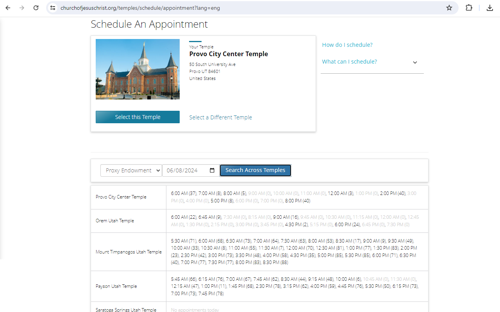

Temple Search
=============

> Search across temples for proxy appointments at the Church of Jesus Christ of Latter-day Saints.

This extension is **not** built by the Church of Jesus Christ of Latter-day Saints.

Browser Store Pages: [Chrome](https://chromewebstore.google.com/detail/temple-search/pblahhcpdnegffcjjcnibcebpmcmkcba) | [Edge](https://microsoftedge.microsoft.com/addons/detail/temple-search/kelhdaiegjgggcgknoacphmgfgoaocfc) | [Firefox](https://addons.mozilla.org/en-US/firefox/addon/temple-search/)

Problem
-------

"I want to worship at the temple. Can I get an appointment?" Pull up the [Temple Scheduler app](https://tosr.churchofjesuschrist.org/) and choose your temple. Let's say Provo City Center temple. "Are there appointments here?" Click 4 or 7 buttons to pick your chosen proxy ordinance, group count, and eventually date. Nope, the calendar is full. Let's switch to the Orem temple. Another 4 to 7 clicks, and that temple is full that day too. How about Mt. Timpanogos? Yep, full too. Draper? Payson? Jordan River? A half hour later I'm exhausted, and I still haven't found a spot. "Can I just search across temples for available appointments?"

Solution
--------

### Install: one time

1. Go to the Chrome Web Store and search for "Temple Search".
2. Install the [Temple Search Chrome Extension](https://chromewebstore.google.com/detail/temple-search/pblahhcpdnegffcjjcnibcebpmcmkcba).

### Search

1. Go to the [Temple Scheduler app](https://tosr.churchofjesuschrist.org/) and notice the new bar at the bottom.
2. Pick your proxy ordinance and date, and click "Search Across Temples".
3. See the available appointments across all temples close to your chosen temple.

   

4. Now that you know where the appointments are, you can make your chosen appointment in the normal way.

Privacy Policy
--------------

This extension does not collect any user data. Your use of the Temple Scheduling App is subject to the [Church's privacy policy](https://www.churchofjesuschrist.org/services/platform/v4/resources/privacy-policy?lang=eng).

License
-------

License: MIT, Copyright Richardson & Sons, LLC
